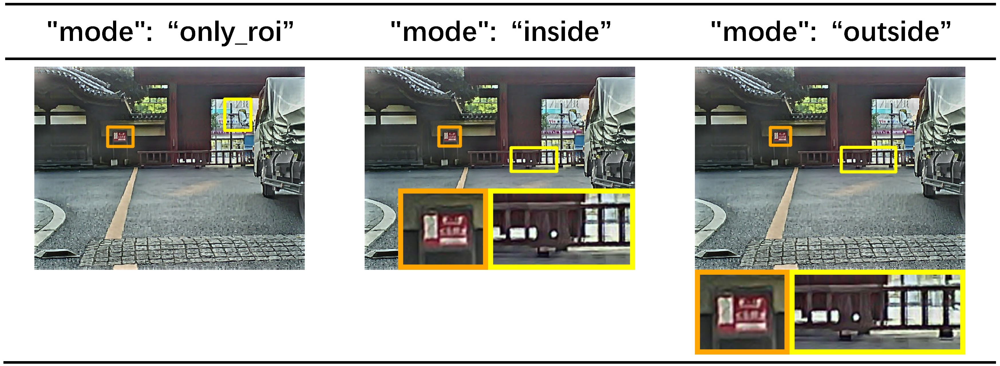
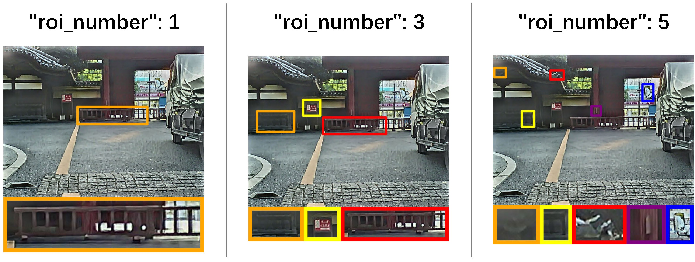
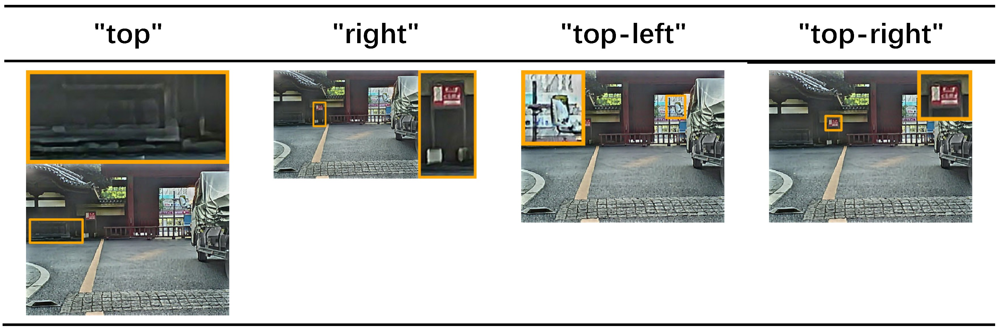

# Image Zooming Tool

💬 [🌟 [中文版本] 🌟](readme_ch.md) 

- **Multiple Modes** 🔍

<div style="display: flex;">
    
</div>
<br>

- **Customizable Number of ROIs** ➕

<div style="display: flex;">
    
</div>
<br>

- **Flexible Placement** 📍

<div style="display: flex;">
    
</div>
<br>

## Usage 🚀
1. Simply install ```python``` and ```opencv-python```.
2. Place all the images you wish to annotate in the same folder (supports different formats and resolutions).
3. Set the parameters in ```zoomTool.py``` under ```CONFIGS```. Refer to <*Parameter Explanation*> for details.
4. Run ```zoomTool.py```.

## Parameter Explanation ⚙️
| Parameter         | Description                                      |
| ----------------- | ------------------------------------------------ |
| images_dir        | Directory where the images are stored           |
| roi_number        | Number of zoom-in boxes to be drawn             |
| mode              | "inside": built-in zoom-in box; "outside": external zoom-in box; "only_roi": only draw the ROI without zooming |
| outside_position  | Position of the external zoom-in box (applies only to "outside" mode)         |
| inside_position   | Position of the built-in zoom-in box (applies only to "inside" mode)          |
| scale             | Zoom scale (applies only to "inside" mode)|
| if_dash_box       | Set to True if you want dashed ROI boxes        |


- The following parameters can be kept as default:

| Optional Parameter | Description                                      |
| ------------------ | ------------------------------------------------ |
| thickness          | Line thickness of the zoom-in box (recommended "auto") |
| colors             | Color of the zoom-in box lines                  |
| dash_length        | Length of dashed lines                          |
| save_folder        | Path to save the modified images                |
| roi_folder         | Path to save the cropped ROIs                   |
| reference_img      | Image used to annotate the ROIs and align resolutions |
